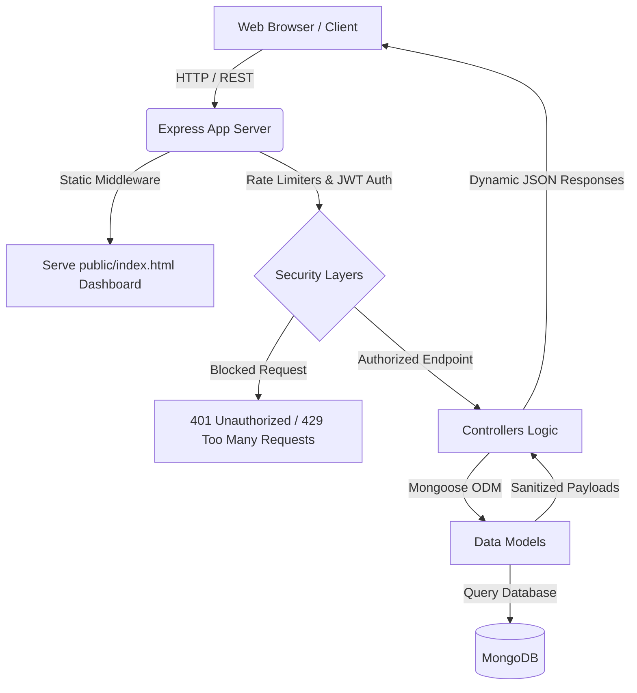
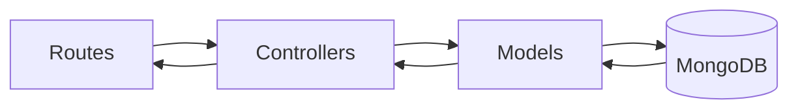
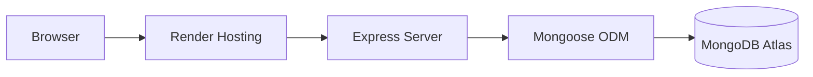

# 🕶️ MetaLens — Premium Meta Glasses Reviews Platform

MetaLens is a high-performance, full-stack reviews ecosystem built to aggregate, analyze, and manage customer experiences for the **Meta Ray-Ban Smart Glasses**. It couples a state-of-the-art **Glassmorphic Dark-Mode Dashboard (Frontend)** with a secure, highly robust **MVC RESTful API (Backend)** powered by Node.js, Express, and MongoDB.

---

## 🔗 Live Deployments & Documentation

* **📄 Live API Documentation (Postman)**: https://documenter.getpostman.com/view/50839299/2sBXwmSDac
* **🚀 Live Backend Production Deployment**: https://meta-glasses-reviews-harshit-pandya.onrender.com/
* **🌐 Local Web Dashboard**: http://localhost:5000/

---

## 📁 Project Folder Structure

This project follows a clean **Model-View-Controller (MVC)** design pattern, keeping data definitions, business controllers, routing maps, and public assets strictly decoupled.

```text
meta_glasses_reviews_harshit_pandya/
├── Meta-Glasses-Reviews.json
├── README.md
└── backend/
    ├── .env
    ├── package.json
    ├── server.js
    ├── config/
    │   └── db.js
    ├── models/
    │   ├── User.js
    │   └── Review.js
    ├── middlewares/
    │   ├── auth.js
    │   └── rateLimiter.js
    ├── controllers/
    │   ├── authController.js
    │   └── reviewController.js
    ├── routes/
    │   ├── authRoutes.js
    │   ├── jwtRoutes.js
    │   └── reviewRoutes.js
    ├── services/
    │   ├── seed.js
    │   └── test_api.js
    └── public/
        ├── index.html
        ├── style.css
        └── app.js
```

---

## 🏗️ Technical Architecture Diagram



---

## 🛠️ Technology Stack

### Backend

* **Node.js** – JavaScript runtime for scalable server-side applications
* **Express.js** – Fast and lightweight REST API framework
* **MongoDB** – NoSQL database for review and user management
* **Mongoose ODM** – Schema modeling, validation, and query abstraction

### Authentication & Security

* **JWT Authentication** – Access & Refresh Token strategy
* **bcryptjs** – Secure password hashing
* **Custom Rate Limiter Middleware** – Brute-force protection
* **Role-Based Authorization** – User/Admin access control

### Frontend

* HTML5
* CSS3
* Vanilla JavaScript
* Glassmorphism UI Design

### Development & Testing

* Postman
* Nodemon
* Git & GitHub

---

## 🗄️ Database Architecture

### User Collection

```json
{
  "_id": "ObjectId",
  "username": "String",
  "email": "String",
  "password": "Hashed String",
  "role": "String",
  "refreshToken": "String",
  "createdAt": "Date"
}
```

### Responsibilities

* User Registration
* Authentication
* Authorization
* Profile Management
* Session Handling

---

### Review Collection

```json
{
  "_id": "ObjectId",
  "reviewID": "String",
  "reviewerName": "String",
  "productModel": "String",
  "rating": "Number",
  "reviewText": "String",
  "verifiedPurchase": "Boolean",
  "country": "String",
  "sentiment": "String",
  "createdAt": "Date"
}
```

### Responsibilities

* Review Storage
* Review Analytics
* Search & Filtering
* AI Summary Generation
* Sentiment Tracking

---

## ✨ Additional Platform Features

### 🔐 Authentication & Authorization

* User Registration and Login
* JWT Access & Refresh Token Authentication
* Protected Routes and Middleware Guards
* Role-Based Access Control (RBAC)

### 📊 Analytics & Insights

* Average Rating Calculations
* Monthly Rating Trends
* Verified Purchase Statistics
* Top Reviewer Identification
* Sentiment Distribution Analysis

### 🤖 AI-Powered Review Intelligence

* Automated Review Summarization
* Pros & Cons Extraction
* Sentiment Classification
* Review Verdict Generation

### 🔍 Advanced Search & Filtering

* Rating-Based Filtering
* Country-Based Filtering
* Product Model Filtering
* Verified Purchase Filtering
* Keyword Search with Debouncing
* Pagination and Sorting Support

### ⚡ Performance & Scalability

* MongoDB Aggregation Pipelines
* Optimized Query Execution
* Modular MVC Architecture
* Custom Middleware Layering
* Bulk Dataset Processing (10,000+ Reviews)

### 🧪 Automated Testing

* 100+ Endpoint Validation Tests
* Authentication Flow Testing
* CRUD Operation Testing
* Error Handling Verification
* Middleware & Security Testing

---

## 🌟 Key Platform Features

### 1. Quantum Obsidian Web Dashboard (Served at `/`)

* **Unified Statistics Panels**: Instantly renders Average Rating, Total Reviews, Verified Purchase Ratio, and Positive Sentiment Percentage.
* **AI Copilot Review Synthesis**: Generates review summaries, pros, cons, and verdicts from customer feedback.
* **Glassmorphic UI**: Modern dark-themed interface with responsive layouts and micro-animations.
* **Interactive Controls**: Real-time filtering by rating, device type, verification status, country, and keywords.
* **Direct CRUD Operations**: Create, update, and manage reviews from the dashboard.

### 2. Scalable RESTful API (Backend)

* Comprehensive CRUD Operations
* Pagination & Sorting Support
* Aggregation Endpoints
* Analytics Endpoints
* Metadata Validation
* Secure Authentication Flows

---

## 🚀 Local Getting Started Guide

### Prerequisites

* Node.js (v18+)
* MongoDB (Local Instance or MongoDB Atlas)

### Setup Steps

#### 1. Navigate to Backend Directory

```bash
cd meta_glasses_reviews_harshit_pandya/backend
```

#### 2. Configure Environment Variables

Create a `.env` file:

```env
PORT=5000
MONGODB_URI=mongodb://localhost:27017/meta_glasses_reviews
JWT_SECRET=your_glowing_jwt_secret_key_here
NODE_ENV=development
```

#### 3. Install Dependencies

```bash
npm install
```

#### 4. Seed Database

```bash
node services/seed.js
```

#### 5. Start Development Server

```bash
npm run dev
```

Server runs at:

```text
http://localhost:5000
```

#### 6. Run Automated Tests

```bash
node services/test_api.js
```

---

## 🔒 Security Middleware Budgets

To protect the infrastructure from abuse and excessive database load, custom rate limits are applied:

* `POST /auth/register` → **5 registrations/min**
* `POST /auth/login` → **10 attempts/min**
* `GET /reviews` → **30 requests/min**
* `GET /search` → **15 requests/min**
* `POST /reviews` → **5 creations/min**
* `DELETE /reviews/:reviewID` → **5 deletions/min**
* `POST /import/json` → **2 uploads/min**
* `GET /admin/*` → **10 requests/min**

> Requests with the header `x-testing: true` bypass limits during automated testing.

---

## 📊 Core API Endpoint Registry

### Authentication & Profile

| Method | Endpoint       |
| ------ | -------------- |
| POST   | /auth/register |
| POST   | /auth/login    |
| GET    | /profile       |
| PATCH  | /profile       |
| DELETE | /auth/account  |

### Review CRUD Operations

| Method | Endpoint                  |
| ------ | ------------------------- |
| GET    | /reviews                  |
| POST   | /reviews                  |
| GET    | /reviews/:reviewID        |
| PUT    | /reviews/:reviewID        |
| PATCH  | /reviews/:reviewID/rating |
| DELETE | /reviews/:reviewID        |

### Aggregations & Analytics

| Method | Endpoint                    |
| ------ | --------------------------- |
| GET    | /stats/average-rating       |
| GET    | /reviews/ai-summary         |
| GET    | /reviews/sentiment-analysis |
| GET    | /stats/top-reviewers        |
| GET    | /stats/monthly-average      |

---

## 🏛️ MVC Architecture



### Route Layer

* Endpoint Mapping
* Middleware Binding
* Request Validation

### Controller Layer

* Business Logic
* CRUD Operations
* Analytics
* Aggregations

### Model Layer

* Schema Definitions
* Validation Rules
* Database Queries

---

## 🚀 Deployment Architecture



### Production Flow

1. Browser sends request.
2. Render-hosted Express server receives request.
3. JWT middleware validates authentication.
4. Controllers execute business logic.
5. MongoDB returns data through Mongoose.
6. Response is sent back to the client.

---

## ⚡ Performance Optimizations

* MongoDB Aggregation Pipelines
* Query Optimization
* Pagination Support
* Lightweight JSON Responses
* Modular MVC Design
* Middleware-Based Request Processing

---

## 🔮 Future Enhancements

* Email Verification
* OTP-Based Password Recovery
* Redis Caching
* Elasticsearch Integration
* Swagger/OpenAPI Documentation
* Docker Containerization
* Kubernetes Deployment
* Socket.IO Real-Time Notifications
* Recommendation Engine
* Advanced Admin Dashboard

---

## 🏆 Project Highlights

✅ Full Stack MVC Architecture

✅ MongoDB + Mongoose Integration

✅ JWT Authentication & Authorization

✅ Access & Refresh Token Strategy

✅ AI Review Intelligence

✅ 10,000+ Review Dataset Processing

✅ Custom Rate Limiting Middleware

✅ Responsive Glassmorphic Dashboard

✅ Automated API Testing Suite

✅ Production Deployment on Render

✅ RESTful API Best Practices

---

## 👨‍💻 Author

**Harshit Pandya**

Backend Developer | MERN Stack Enthusiast

Built with a focus on scalable architecture, security, performance optimization, clean code practices, and modern backend engineering.
